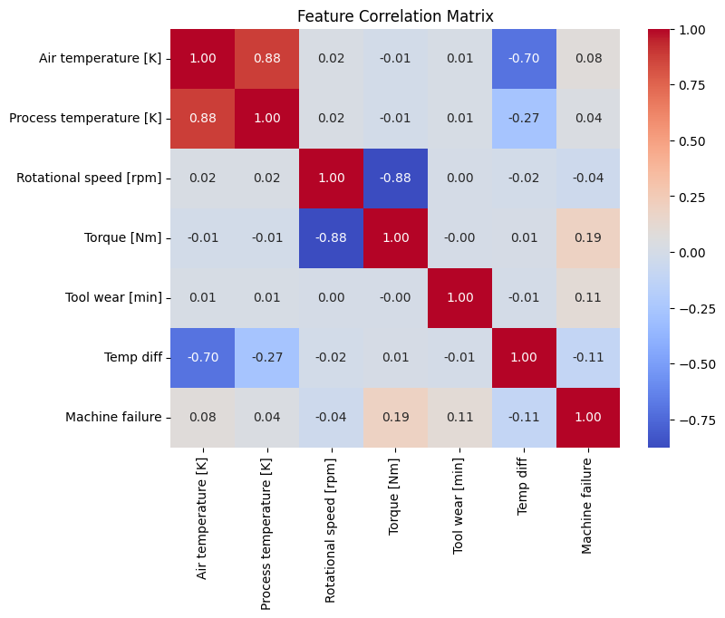
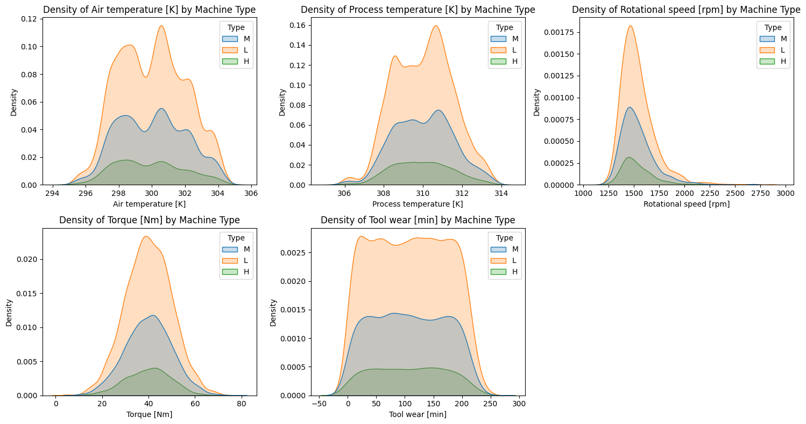
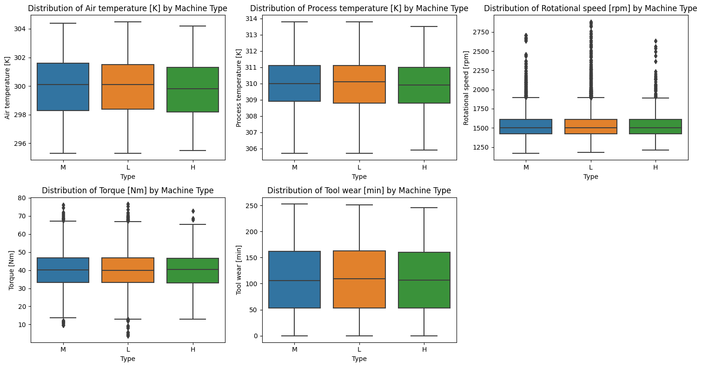
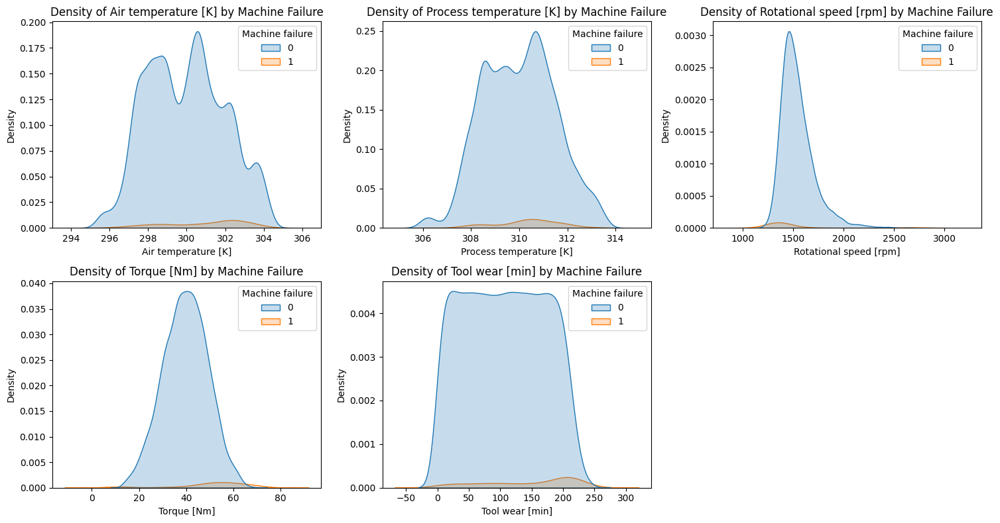
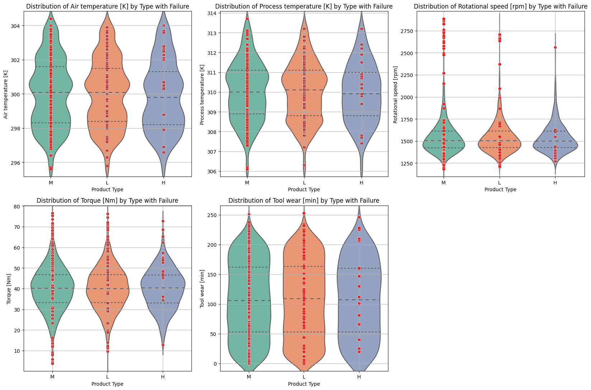
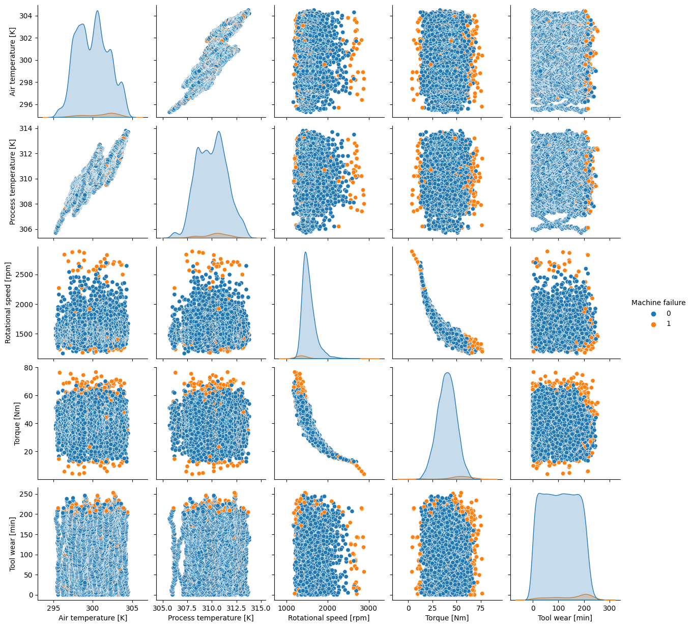
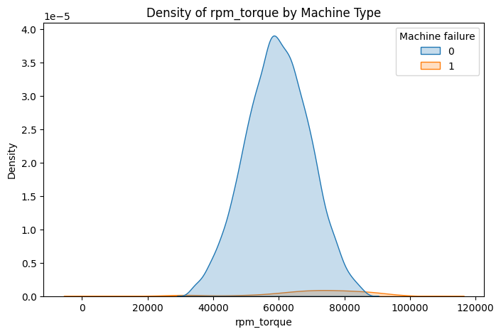

# Predictive Maintenance with Machine Learning
## 🔧 Overview
Predictive maintenance (PM) is a strategy that leverages machine learning and analytics on historical datasets that accurately reflect the health and operating condition of the machines to anticipate equipment failures before they happen. 

This project demonstrates the process to build a supervised learning predictive maintenance model trained on a set of milling machines data.

## 🔧 Why predictive maintenance?
- **Minimize Unplanned Downtime**: Detect potential failures early and conduct timely maintenance.
- **Optimize Workforce Efficiency**: Eliminate unnecessary routine checks and assist technicians to focus on machines that potentially wear out.
- **Support Decision Making**: Use data-driven insights to prioritize tasks and maintenance schedules instead of relying solely on manual inspections or static checklists.
- **Reduce Maintenance Costs**: Preventive actions taken at the right time can save cost on emergency repairs and equipment replacements, as well as prevent quality issues on product.

## 🔧 Project Highlights
- **Tackled Class Imbalanced**: Applied techniques and metric selection to ensure successful supervised learning on an imbalanced dataset.
- **Model Benchmarking**: Tested and compared 7 models including tree-based algorithms, linear models to neural network.
- **Promising Model Performance**: Achieved 99% accuracy and 83.75% Matthews Correlation Coefficient (MCC) after a series of selection and tuning.
- **Proof of Concept for Production Scaling**: Project completed the groundwork for building a pipeline from data input to model training and future upgrades involving real-time monitoring, alerting, and production integration.

## 🔧 Dataset Overview
The dataset used is a set of synthetic dataset modeled after an existing milling machine, with sample size of 10,000 and 14 features.

This dataset is part of the following publication:
S. Matzka, "Explainable Artificial Intelligence for Predictive Maintenance Applications," 2020 Third International Conference on Artificial Intelligence for Industries (AI4I), 2020, pp. 69-74, doi: 10.1109/AI4I49448.2020.00023.

## 🔧 Notebook Breakdown
### **[Exploratory Data Analysis (EDA)](https://github.com/LeeJiaYu99/Predictive-Maintenance-with-Machine-Learning/blob/master/notebooks/Exploratory%20Data%20Analysis%20(EDA).ipynb)**

**Feature correlation**\
Some features are correlated with each other and these features are potential for feature tranformation in feature engineering process.

**Analysis by Machine Type**\
ANOVA F-test and Levene test shown that 'Type' does not significantly affect most of the features.

ANOVA F-test & Levene's Test for Homogeneity of Variance: 
| Feature                | F-statistic (p-value) | W-statistic (p-value) | Conclusion on mean & variance of each 'Type'                |
|---------------------------|-------------|---------|--------------------------------|
| Air temperature [K]       | 2.6964 (0.0675)     | 0.9389 (0.3911)  | No significant difference  |
| Process temperature [K]   | 1.6332 (0.1954)     | 0.4356 (0.6469)  | No significant difference  |
| Rotational speed [rpm]    | 0.1156 (0.8909)     | 0.4007 (0.6699)  | No significant difference  |
| Torque [Nm]               | 0.1282 (0.8797)     | 0.7434 (0.4755)  | No significant difference  |
| Tool wear [min]           | 0.3408 (0.7112)     | 1.1824 (0.3066)  | No significant difference  |

\
The distribution plot and box plot of different machine type support the result of previous statistical tests that different machine type has the same distribution.

  
  

**Analysis by Failure Type**\
Most of the individual features show no strong separation between failure and non-failure classes. The overlapping in the values for the two classes suggests that individual features alone may not be powerful enough. Only some extreme values is distinguishable from the separate class.

  
  

**Joint Features Relationship**\
Joint distributions show clearer clustering patterns between positive and negative samples. For example, failures tend to occur when the rotational speed is high and the torque is low.

\
Besides, interation terms such as the product of rotational speed and torque can also indicate some trend of high rpm_torque value tend to have more failures.

### **[Feature Engineering](https://github.com/LeeJiaYu99/Predictive-Maintenance-with-Machine-Learning/blob/master/notebooks/Feature%20Engineering.ipynb)**

#### New Features
Based on understanding obtained from EDA process and domain practice, the following new features are created to enhance the dataset representation.

| New Features               | Transformation | Rationale |
|---------------------------|------------------|---------|
| Temperature Difference ('Temp diff') | Temperatre difference = Process temperature [K] - Air temperature [K] | Reflects the heat produced by the machine compared to environmental temperature |
| Power/Workdone ('rpm_torque') | rpm_torque = Rotational speed [rpm] * Torque [Nm] | Power that captures mechanical stress and workload |

#### Evaluation Metrics
Due to **class-imbalanced** in the dataset, F1-score and Matthews correlation coefficient are used as performance matrics as they take into account for FP and FN.

$$
F_1 = \frac{2 \cdot \text{Precision} \cdot \text{Recall}}{\text{Precision} + \text{Recall}} 
\hspace{2cm}
\text{MCC} = \frac{TP \cdot TN - FP \cdot FN}{\sqrt{(TP + FP)(TP + FN)(TN + FP)(TN + FN)}}
$$

| F1 Score Range | Interpretation |  | MCC | Interpretation
|---------------------------|------------------|---------|--------------------------------------|---------------|
| $\geq 0.9$      | Great, with risk of overfitting      | | +1 | Perfect prediction |
| $0.7 \leq \text{F1} < 0.9$   | Good      | | 0 | No better than random guessing |
| $0.5 \leq \text{F1} < 0.7$   | Average      | | -1 | Worst possible prediction |
| $< 0.5$             | Poor      | |  | |

#### Baseline Model
A baseline model is built using a simplest decision tree and all raw features without any elimination and transformation.
| Model | Features | F1-score | MCC |
|------------------|------------------|------------|-------------|
| Decision tree | ['Type', 'Air temperature', 'Process temperature', 'Temp diff', 'Rotational speed', 'Torque', 'rpm_torque', 'Tool wear'] | 0.7344 | 0.7265 |

#### Feature Selection
Iterative experiments are done to eliminate unimportant features and retain features that could contribute to generalization of model. The performance of model increases by 5% after removing 'Process temperature' and keeping derived 'Temp diff'.
| Model | Features | F1-score | MCC |
|------------------|------------------|------------|-------------|
| Decision tree | ['Type', 'Air temperature', 'Temp diff', 'Rotational speed', 'Torque', 'rpm_torque', 'Tool wear'] | 0.7725 | 0.7653 |

### **[Model Training](https://github.com/LeeJiaYu99/Predictive-Maintenance-with-Machine-Learning/blob/master/notebooks/Model%20Training.ipynb)**

#### Model Selection 
The best fitted model is chosen among the following 7 types of model:
- Tree-based model
    > Decision Tree, Random Forest, CatBoost, XGBoost
- Linear model
    > Logistic Regression, Support Vector Machine (SVM)
- Neural network
    > MLP classifier

| Model         | Features | F1-Score  | F1-Score (Std) | MCC      | MCC (Std)  |
|-------------|---------------|----------|----------------|-----------|----------------|
| Random Forest | ['Type', 'Air temperature', 'Temp diff', 'Rotational speed', 'Torque', 'rpm_torque', 'Tool wear'] | 0.824023  | 0.035745       | 0.829725 | 0.031969    |

#### Hyperparamter Tuning
Grid search is applied to the best model (random forest). This tuning slightly improve the performance and reduce the variance accross different folds. 
> **Best Hyperparameters**  
> `{'class_weight': 'balanced', 'criterion': 'entropy', 'max_depth': 20, 'max_features': None, 'min_samples_leaf': 2, 'min_samples_split': 2, 'n_estimators': 300}`

| Model         | Features | F1-Score  | F1-Score (Std) | MCC      | MCC (Std)  |
|-------------|---------------|----------|----------------|-----------|----------------|
| Random Forest | ['Type', 'Air temperature', 'Temp diff', 'Rotational speed', 'Torque', 'rpm_torque', 'Tool wear'] | 0.837640  | 0.025422       | 0.837531 | 0.023959    |

## 🔧 Future Improvement
**Multiclass Classification for Failure Type**\
The dataset also include labels for different types of machine failures. If the dataset collected is larger, there would be chances to develop another multiclass classification model to predict types of failure; thus, assisting the equipment sustaining teams in diagnostics and targeted repairs.

**Data Pool**\
Continuous data collection is required to develop more robust model that is generalized for real production use case.

**Feature Enrichment**\
Having more research on environmental and operational variables to include additional features that can improve model's understanding and refine the predictions.

**Other Techniques to Address Class Imbalance**\
SMOTE (Synthetic Minority Over-sampling Technique) and upsampling can be explored to help model detects minority class failure more accurately.

**IoT Integration & Real Time Monitoring**\
Consider implementing a comprehesive sensory and monitoring framework for real time capturing of machine and environmental data. Such system facilitates in performing timely inference, as well as continuous learning and model updates. By then, the model could be transitioned to time-series modeling that take into account of timestamp. 
\
\
To realize this, investments in IoT devices and data infrastructure are needed to support continuous data flow and real-time processing.

## 🔧 Real World Challenges
**Data Integration**\
Capturing machine measurements requires integration with multiple IoT devices but not all devices are easily integrated and some data may not be tracked or stored in specific format.

**Machine Lifecycle**\
Much more prior studies and simulation on specific machine to understand about its lifecycle is better to grasp understanding on machine behaviour.

**Domain Expertise**\
Technical knowledge from subject matter expert should be treasured and applied in feature engineering to avoid mere random probabilistic prediction.

**End-to-End Pipeline & Deployment**\
From a full project perspective, an establish pipeline ranges from automated data ingestion, model training and deployment, system integration, dashboard visuallization to real time alerting still require strong collaboration between multiple cross-functional teams.
